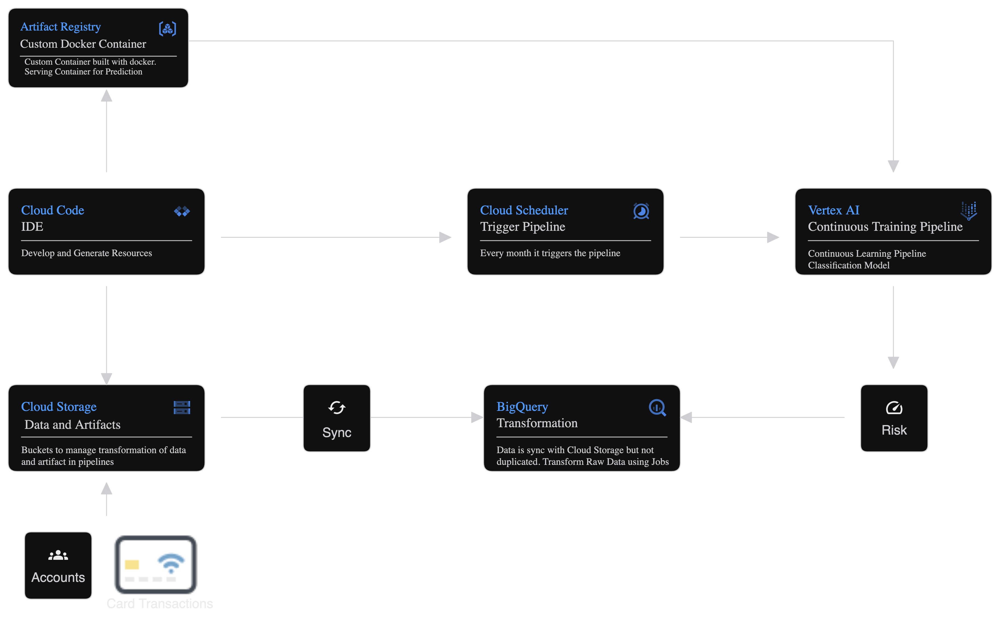

## 🚀 End to End MLOps with Google Cloud and Berka Dataset - in the making...

In this project, we're taking a trip back to the 90's and integrate MLOps into the workflow of the most famous Bank of Kaggle.

Instead of having one specific goal, this project showcases the integration of a MLOps lifecycle in the workflow of a Bank.

  

## 📚 Berka Dataset

In the original competition of 99', the data about the clients and their accounts consisted of following relations:

- relation account (4500 objects in the file ACCOUNT.ASC) - each record describes static characteristics of an account,
- relation client (5369 objects in the file CLIENT.ASC) - each record describes characteristics of a client,
- relation disposition (5369 objects in the file DISP.ASC) - each record relates together a client with an account,
- relation permanent order (6471 objects in the file ORDER.ASC) - each record describes characteristics of a payment order,
- relation transaction (1056320 objects in the file TRANS.ASC) - each record describes one transaction on an account,
- relation loan (682 objects in the file LOAN.ASC) - each record describes a loan granted for a given account,
- relation credit card (892 objects in the file CARD.ASC) - each record describes a credit card issued to an account,
- relation demographic data (77 objects in the file DISTRICT.ASC) - each record describes demographic characteristics of a district.

Each account has both static characteristics (e.g. date of creation, address of the branch) given in relation "account" and dynamic characteristics (e.g. payments debited or credited, balances) given in relations "permanent order" and "transaction". Relation "client" describes characteristics of persons who can manipulate with the accounts. One client can have more accounts, more clients can manipulate with single account; clients and accounts are related together in relation "disposition". Relations "loan" and "credit card" describe some services which the bank offers to its clients; more credit cards can be issued to an account, at most one loan can be granted for an account. Relation "demographic data" gives some publicly available information about the districts (e.g. the unemployment rate); additional information about the clients can be deduced from this.

You can find more about the Berka Dataset [here](https://sorry.vse.cz/~berka/challenge/pkdd1999/berka.htm).

## 🎯 Project Cases

Each case follows a specific architecture made using [Google Architecture Diagrams Tool](https://googlecloudcheatsheet.withgoogle.com/architecture)

### Case 1: Moving fast from MVP to MLOps

The idea is to make the average Data Scientists able deliver features without using too much time and complex frameworks. Fancy IAC and MLOps tools are cool, but not everyone wants to use them. In the documentation, you will find my personal method to switch fast from Data Scientist to ML engineer.

### Case 2: Risk Assessment for Primary Accounts - In progress...

BerkaBank asked us to build a stress test for the primary accounts. The request is to evaluate, based on transaction data, the accounts with a probability of a future Balance Distress.

Starting from this generic business task we will use the CRISPDM and come up with the following solution:

_A Continuous Training Pipeline that ranks accounts based on a conditional probability to stay for D consecutive days with a balance under a certain amount X._

  

### Case 3: Mail Funnel. - Coming Soon! 📬

To promote customer interaction, at the end of each month we will schedule a mail to thank our customer for their choice and use AI to craft a little report on their spending with personalized product suggestions.
