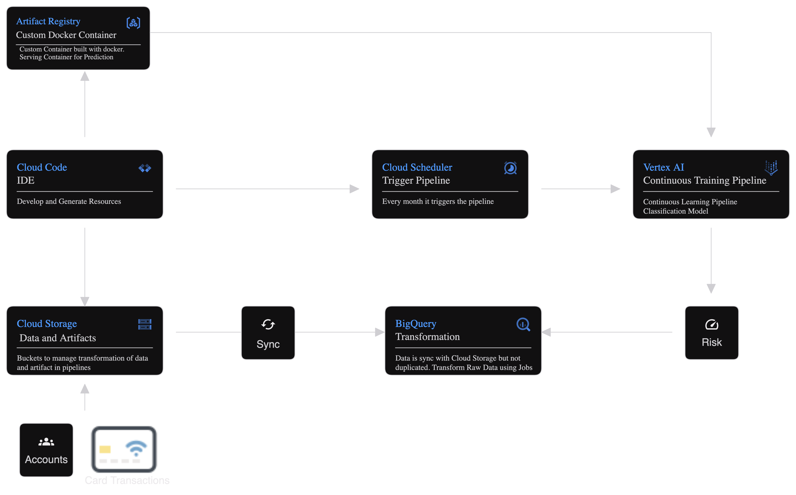

# Risk Assessment for Primary Accounts

BerkaBank has tasked us with developing a stress test for primary accounts. The goal is to evaluate accounts with a high probability of future Balance Distress based on transaction data.

Using the CRISP-DM methodology, we will develop a solution encompassing:

- _A Continuous Training Pipeline that ranks accounts based on the conditional probability of remaining below a certain balance amount M for N consecutive days._

## Table of Contents

1. [Model Design and Architecture](#model-design-and-architecture)
2. [Data Processing](#data-processing)
3. [Feature Engineering](#feature-engineering)
4. [Feature Selection](#feature-selection)
5. [Hyperparameter Tuning](#hyperparameter-tuning)
6. [Evaluation](#evaluation)
7. [Model Deployment](#model-deployment)
8. [Continuous Training Pipeline](#continuous-training-pipeline)

## Model Design and Architecture

  

### Infrastructure Overview

We assume a model MD that enables the prediction of Balance Distress. Key infrastructure components include:

- **Data Sources**: Transactions and Accounts hosted in **Cloud Storage** and synchronized with **BigQuery** for intensive pre-processing.
- **Artifact Registry**: To create reusable custom containers for components and packages.
- **Vertex AI**: To manage prediction containers in the Model Registry supporting both Batch and Online Predictions.
- **Cloud Scheduler**: To automate the pipeline execution based on time or events.

This setup ensures a scalable and maintainable architecture with minimal user intervention.

### Model Design

#### Prediction Goals

- **Primary Accounts**: Accounts with seniority > D days and minimum T transactions.
- **Balance Distress**: N consecutive days with a balance under M in CZK.

_Adjustments:_

- As N increases or M decreases, incidents become rarer.
- As D and T increase, fewer primary accounts are identified.

#### Target Construction

1. **Calculate End of Day Balance (EoDB)**.
2. **Identify when an account becomes primary**.
3. **Register incidents** when balance remains below M for N consecutive days.

#### Training Period

Use transaction data up to Y years, balancing depth of analysis with the risk of noise. Ensure a dark period in the test set to avoid data leakage.

#### Model Choice

A tree-based approach is preferred due to the high variability in data and feature interactions, avoiding multicollinearity issues common with linear models.

#### Key Features

Summary statistics on EoDBalance and past incident flags.

#### Handling Imbalances

Downsampling non-incident data to achieve a 60-40 negative-to-positive ratio. Models like LightGBM benefit from this approach.

#### Data Leakage and Bias

Ensure balanced training data by sampling non-incident accounts from the same districts and timeframes as incidents, focusing on cash flow management as the primary differentiator.

#### Model Serving

Scheduled batch predictions are the best approach for internal stress testing.

## Data Processing

1. **Compute EOD Balance**, imputing days without transactions as 0.
2. **Pair transactions** of accounts with and without incidents.
3. **Down-sample non-incident accounts** as described above.

**Output**: Fair EOD Balance dataset.

## Feature Engineering

**Primary features**:

- Sum, Avg, Count of Fair EOD Balance over periods from 3 to 30 days.

**Derived features**:

- Ratio of primary features (enforced with non-zero values).

## Feature Selection

Utilize backward feature selection with Shapley Values for model-agnostic feature selection.

More info: [ShapRFECV - Recursive Feature Elimination using SHAP importance](https://ing-bank.github.io/probatus/tutorials/nb_shap_feature_elimination.html)

## Hyperparameter Tuning

**Random Forest**:

- n_estimators: Number of trees in the forest.
- max_dept: Maximum depth of each tree.
- min_samples_split: Minimum number of samples required to split an internal node.
- min_samples_leaf: Minimum number of samples required to be at a leaf node.
- max_features: Number of features to consider when looking for the best split.

**LightGBM**:

- num_leaves: Main parameter to control the complexity of the tree model.
- min_data_in_leaf: Important parameter to prevent over-fitting in a leaf-wise tree.
- max_depth: Controls the maximum tree depth, used to deal with over-fitting when #data is small.
- learning_rate: Shrinks the feature weights to make the boosting process more conservative.
- n_estimators: Number of boosting iterations, equivalent to the number of trees.

## Evaluation

**AUC** as most important metric to evaluate model fit.

Further analysis for an optimal cut-off will be implemented based on validation data.

## Model Deployment

Model will be pushed to Model Registry if performance goal is reached.

## Continuous Training Pipeline

1. **Establish a performance benchmark** and train the initial model.
2. **Periodic model retraining** to adapt to natural data shifts.
3. **Monthly preprocessing** with target data sent to the batch bucket in cloud storage.
4. **Store results in a Data Warehouse.**
